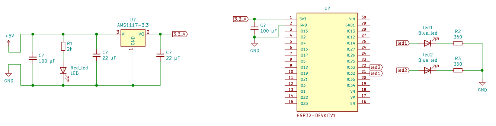

# Web Server com ESP32

### Demonstração

Para mostrar o funcionamento do sistema foi criado um berve vídeo mostrando a interação do sistema com o usuário: 

### Resumo

Este projeto implementa um server que pode ser usado para automação, seja industrial ou residencial

Podemos controlar as saídas por qualquer navegador na mesma rede. O IP do ESP é impresso na Porta Serial

### Esquemático do Hardware 

Esse projeto exige uma boa alimentação, pois ao usar a função "WiFi.begin(ssid, password)"
a antena de 2.4 GHz é acionada e nesse instante o dispositivo consome muita corrente. Se a alimentação não estiver boa,
a tensão de pode cair e consequentemente ativar o brownout reset do dispositivo, o reiniciando.

Para resolver isso usamos um módulo externo para alimentação, usando o AMS1117, os corretos valores dos capacitores de 
desacoplamento e uma boa fonte conseguimos uma alimentação eficiente. Podemos ver na imagem o esquemático:

### Como Usar

Para clonar projetos do PlatformIO como esse, siga o guia passo-a-passo disponível no repositório: [Instrucoes-PlatformIO](https://github.com/Zebio/Instrucoes-PlatformIO)

### Software

O código foi escrito no VSCode, com auxílio da Extensão [PlatformIO](https://docs.platformio.org/en/latest/integration/ide/vscode.html). 
Usando Framework Arduíno e a Placa ESP32 DEV module.

